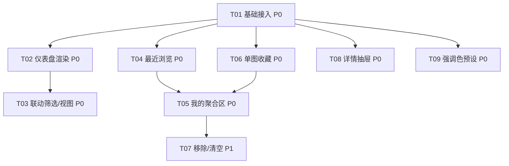

# SkyChart Pro · 增量架构设计 + 任务分解（D / R / T 三大模块）

> 架构师：高见远（Gao）｜ 基于增量 PRD（已核对代码现状）｜ 纯前端 vanilla JS 增量开发

---

## 1. 实现方案 + 框架选型

**核心结论：保持现有技术栈，不做重写、不引入构建工具、不引入任何框架或图表库。**

| 维度 | 决策 | 理由 |
|------|------|------|
| 语言 / 运行 | 原生 HTML + CSS + 全局作用域 JS（经 `<script>` 顺序加载，共享词法作用域，非 ES module） | 现状既定，PRD 明确要求"保持现有技术栈与模式" |
| 构建工具 | 无（Vite/Webpack 一律不引入） | 项目零构建，新增文件只需在 `index.html` 的 `<script>` 链末尾追加 `<script src="js/xxx.js">` |
| UI 框架 | 无（不引入 React/Vue） | 纯 DOM 字符串拼接 + 事件委托的主流模式已成熟 |
| 图表库 | 无（不引入 ECharts/D3/Chart.js） | D-02 条形、D-03 环形均用**手写 SVG**（`<rect>`/`<path>` 环形扇区），配色走 CSS 变量，随明暗与强调色联动 |
| 状态管理 | 延续 `state.js` 单一数据源 + `applyFilters()` 单一渲染管线 | 新增状态一律在 `state.js` 声明，新增列表变化一律走 `filterState` → `applyFilters()` |
| 持久化 | 延续 `favorites.js` 的 localStorage try/catch 封装风格 | 新增「最近浏览」「单图收藏」「强调色」均复用此风格 |
| 样式主题 | 延续 `data-theme`（明暗）正交叠加 `data-accent`（强调色） | `--shadow-glow` 由写死改为随预设联动变量 |

**技术难点与对策**

1. **分布聚合性能（Q7）**：国家分布/类型分布的聚合在 `renderDashboard()` 首次调用时计算一次，结果缓存到模块级变量（`_countryDistCache` / `_typeDistCache`），后续切换视图不重算，仅重渲染 SVG。
2. **视图切换无路由（Q4）**：新增 `currentView` 状态，主内容区并置 `#dashboardView` 与 `#browseView` 两个容器，按状态 `hidden` 切换；侧边栏「概览」入口驱动。
3. **抽屉与模态复用（T-01）**：详情抽屉复用现有 `.modal` 的 `active` 类 + overlay + ESC 关闭模式，仅右滑定位（`drawer-right`）。
4. **主题正交（Q2）**：`documentElement[data-accent]` 与 `[data-theme]` 正交；accent 变量覆盖块置于 `[data-theme="dark"]` 之后，确保同等特异度下 accent 胜出。

---

## 2. 文件列表（相对路径）

> 约定：`[新增]` = 新建文件；`[修改]` = 在现有文件上追加/修改。脚本引入顺序在 `index.html` 末尾按依赖追加。

### 新增文件
| 文件 | 职责 |
|------|------|
| `js/dashboard.js` `[新增]` | 概览仪表盘：统计卡片、国家条形、类型环形、联动筛选、视图切换 |
| `js/recent.js` `[新增]` | 最近浏览（机场/航图）localStorage 封装 + 「我的」聚合区渲染 |
| `js/drawer.js` `[新增]` | 机场详情抽屉（右侧滑入 + overlay + ESC），含 ICAO 分组说明 |
| `js/theme-preset.js` `[新增]` | 强调色预设（粉/海洋/森林）逻辑与色板弹层 |

### 修改文件
| 文件 | 修改点 |
|------|--------|
| `js/state.js` `[修改]` | 新增 `currentView` / `recentAirports` / `recentCharts` / `favoriteCharts` / `accentPreset` 状态声明 |
| `js/dom.js` `[修改]` | 登记新 DOM 引用：`mySection` / `dashboardView` / `browseView` / `overviewNav` / `accentToggle` / `accentPanel` / `airportDrawer` |
| `js/favorites.js` `[修改]` | 复用风格新增 `loadFavoriteCharts/saveFavoriteCharts/isFavoriteChart/toggleFavoriteChart` 与键 `skychart_fav_charts` |
| `js/airport-list.js` `[修改]` | `renderAirportItem` 增加 `fa-circle-info` 信息按钮（带 `data-code`），不抢占主体点击 |
| `js/charts.js` `[修改]` | `renderPDFFiles` 卡片加星标按钮；`openPDFViewer` 埋 `addRecentChart`；`loadAirportCharts` 埋 `addRecentAirport` |
| `js/events.js` `[修改]` | 统一事件委托：概览入口、仪表盘条形/扇区点击、信息按钮、单图星标、我的区项/移除/清空、🎨 色板、抽屉/色板 ESC 关闭 |
| `js/main.js` `[修改]` | `init()` 中按序插入 `loadRecentAirports/loadRecentCharts/loadFavoriteCharts/initAccent/renderMySection/renderDashboard/switchView` |
| `index.html` `[修改]` | 侧边栏加「我的」区 `#mySection` + 「概览」入口 `#overviewNav`；主区加 `#dashboardView`/`#browseView`；header 加 🎨 `#accentToggle` + `#accentPanel`；追加 `#airportDrawer` 抽屉；末尾按序追加 4 个新脚本 |
| `style.css` `[修改]` | 新增 `[data-accent]` 变量覆盖块（置于 dark 主题之后）；`.my-section`/`.dashboard-view`/`.stat-card`/`.dist-bar`/`.donut`/`.drawer-right`/`.accent-panel`/`.accent-swatch`/`.chart-fav-btn` 样式 |

> 注：`js/controls.js` / `js/modal.js` 原则上**无需修改**——联动筛选复用现有 `applyFilters()` 与 `.modal` 模式即可；若需在类型扇区点击后强制选中一个含该类型的机场，才微调 `controls.js`，本设计默认不改动。

---

## 3. 数据结构与接口

### 3.1 新增状态变量（`js/state.js`）
```js
// 视图：'dashboard' | 'browse'
let currentView = 'browse';

// 最近浏览机场（ICAO 代码，最多 8，unshift 去重）
let recentAirports = [];

// 最近浏览航图（复合键 code::filename，最多 12，unshift 去重）
let recentCharts = [];

// 收藏航图（复合键 code::filename）
let favoriteCharts = [];

// 强调色预设：'pink' | 'ocean' | 'forest'
let accentPreset = 'pink';
```

### 3.2 localStorage 键名约定
| 键 | 值 | 模块 |
|----|----|------|
| `skychart_favorites` | `string[]`（机场代码） | 现有 `favorites.js` |
| `skychart_fav_charts` | `string[]`（复合键 `code::filename`） | 新增 `favorites.js` |
| `skychart_recent_airports` | `string[]`（机场代码，≤8） | `recent.js` |
| `skychart_recent_charts` | `string[]`（复合键，≤12） | `recent.js` |
| `skychart_accent` | `'pink'\|'ocean'\|'forest'` | `theme-preset.js` |

### 3.3 新增 DOM 引用（`js/dom.js`）
```js
const mySection     = document.getElementById("mySection");      // 我的聚合区（侧边栏顶部，可折叠）
const dashboardView = document.getElementById("dashboardView");  // 概览视图容器（主内容）
const browseView    = document.getElementById("browseView");     // 浏览视图容器（原有 pdf-section 外包）
const overviewNav   = document.getElementById("overviewNav");    // 侧边栏「概览」入口
const accentToggle  = document.getElementById("accentToggle");   // header 🎨 按钮
const accentPanel   = document.getElementById("accentPanel");    // 强调色色板弹层
const airportDrawer = document.getElementById("airportDrawer");  // 机场详情抽屉（.modal 模式）
```

### 3.4 关键函数签名（Mermaid 类图见 `docs/class-diagram.mermaid`）

**`js/favorites.js`（扩展）**
```js
const FAV_CHART_KEY = "skychart_fav_charts";
function loadFavoriteCharts();                       // → 填充 state.favoriteCharts
function saveFavoriteCharts();                       // try/catch 写回
function isFavoriteChart(key);                       // key = code + "::" + filename
function toggleFavoriteChart(code, filename);        // 切换并持久化
```

**`js/recent.js`（新增）**
```js
const RECENT_AIRPORT_KEY = "skychart_recent_airports";
const RECENT_CHART_KEY   = "skychart_recent_charts";
const RECENT_AIRPORT_MAX = 8;
const RECENT_CHART_MAX   = 12;

function loadRecentAirports();                       // → state.recentAirports
function saveRecentAirports();
function addRecentAirport(code);                     // unshift 去重 + 截断 8 + save
function loadRecentCharts();                         // → state.recentCharts
function saveRecentCharts();
function addRecentChart(code, filename);             // 复合键，unshift 去重 + 截断 12 + save
function removeRecentAirport(code);                  // 移除 + save + renderMySection()
function removeRecentChart(key);                     // 移除 + save + renderMySection()
function clearRecents();                             // 清空两类 + save + renderMySection()
function renderMySection();                          // 渲染 收藏机场/收藏航图/最近浏览 三子区
```

**`js/dashboard.js`（新增）**
```js
let _countryDistCache = null;                        // 模块级缓存（Q7）
let _typeDistCache = null;

function computeCountryDistribution();               // 聚合 airports by country，Top12 + 其它，缓存
function computeChartTypeDistribution();             // 聚合所有 charts 经 getChartType，缓存，偏差归 other
function renderDashboard();                          // 渲染 D-01 卡片 / D-02 国家条形 / D-03 类型环形
function handleDashboardCountryClick(country);       // 写 filterState.country → switchView('browse') → applyFilters()
function handleDashboardTypeClick(type);             // 写 chartTypeFilter → switchView('browse') → 重渲当前机场
function switchView(view);                           // 设置 currentView，显隐 dashboardView/browseView，侧栏高亮
```

**`js/drawer.js`（新增）**
```js
function openAirportDrawer(code);                    // findAirportByCode → 填充抽屉 → .active + 锁滚动
function closeAirportDrawer();                       // 移除 .active + 恢复滚动
```

**`js/theme-preset.js`（新增）**
```js
const ACCENT_KEY = "skychart_accent";
const ACCENTS = ["pink", "ocean", "forest"];

function initAccent();                               // 读 localStorage → setAccent(saved, false)
function setAccent(preset, persist = true);         // 设 documentElement[data-accent] + 持久化 + 面板高亮
function openPresetPanel();                          // accentPanel.add('active')
function closePresetPanel();                         // accentPanel.remove('active')
```

---

## 4. 程序调用流程（时序图见 `docs/sequence-diagram.mermaid`）

涵盖 4 条关键路径：(a) 启动初始化 (b) 仪表盘国家条→筛选 (c) 收藏单图 (d) 切换强调色。

**关键交互约定**
- 视图切换 `switchView('browse')` 后，仪表盘的国家/类型联动一律复用 `applyFilters()`（国家）与 `renderPDFFiles()`（类型），不新增渲染管线。
- 单图收藏后**仅重渲当前机场卡片 + 「我的」区**，不重渲机场列表（机场列表只关心机场级收藏）。
- 强调色切换为**纯 CSS 变量驱动**，无需 JS 重渲，仅写 `data-accent` 与 localStorage。

---

## 5. 依赖包列表

- **无新增 npm 依赖**（项目本就零构建、零依赖）。
- 复用现有 **Font Awesome 6.4.0 CDN**（已通过 `<link>` 引入），新增图标仅用其既有图标（`fa-circle-info` / `fa-star` / `fa-palette` 🎨 用 `fa-palette` 或 emoji）。
- 新增 4 个 `js/*.js` 为纯原生脚本，按 `<script src>` 顺序加载，无打包、无转译、无类型检查。

---

## 6. 任务列表（有序、含依赖、按实现顺序）

> 注：本分解按 team-lead 明确的 **8–15 项**粒度产出（覆盖 D/R/T 全模块），而非默认 5 项上限，以匹配增量开发的文件分组；每个任务均 ≥3 个相关文件。优先级 P0/P1/P2 取自 PRD。

### T01 · P0 · 基础状态/DOM/CSS/初始化接入（基础设施）
- **源文件**：`js/state.js`、`js/dom.js`、`js/main.js`、`style.css`
- **依赖**：无
- **内容**：在 `state.js` 声明 `currentView/recentAirports/recentCharts/favoriteCharts/accentPreset`；`dom.js` 登记 7 个新 DOM 引用；`style.css` 追加 `[data-accent]` 变量覆盖块（置于 `[data-theme="dark"]` 之后）与 `.my-section/.dashboard-view/.stat-card/.dist-bar/.donut/.drawer-right/.accent-panel/.accent-swatch/.chart-fav-btn` 基础样式骨架；`main.js` 预留初始化插入点（本任务先不调用新模块，仅搭好骨架）。
- **对应 PRD**：全局基础设施 / D-05 / T-03 基座

### T02 · P0 · 概览仪表盘：统计卡片 + 国家条形 + 类型环形
- **源文件**：`js/dashboard.js` `[新增]`、`index.html`、`js/state.js`
- **依赖**：T01
- **内容**：实现 `computeCountryDistribution()`（Top12+其它，缓存）、`computeChartTypeDistribution()`（经 `getChartType`，缓存，其它归并）、`renderDashboard()`（D-01 取自 `DATA.meta`；D-02 手写 SVG 横向条形；D-03 手写 SVG 环形）。`index.html` 增加 `#dashboardView` 空壳容器。
- **对应 PRD**：D-01、D-02、D-03

### T03 · P0 · 概览联动筛选与视图切换
- **源文件**：`js/dashboard.js`、`js/events.js`、`index.html`、`js/airport-list.js`(间接)
- **依赖**：T02
- **内容**：实现 `handleDashboardCountryClick`/`handleDashboardTypeClick`/`switchView`；`events.js` 用委托绑定 `#dashboardView` 内 `.dist-country-bar`、`.donut-sector` 点击与侧栏 `#overviewNav`；联动复用 `applyFilters()`（国家）与 `chartTypeFilter`+`renderPDFFiles()`（类型）；视图显隐 `#dashboardView`/`#browseView`。
- **对应 PRD**：D-04、D-05、D-06

### T04 · P0 · 最近浏览记录（localStorage 持久化）
- **源文件**：`js/recent.js` `[新增]`、`js/state.js`、`js/charts.js`、`js/main.js`
- **依赖**：T01
- **内容**：`recent.js` 实现 `load/addRecentAirport`（≤8）、`load/addRecentChart`（复合键 ≤12）全部 try/catch；`charts.js` 中 `loadAirportCharts` 埋 `addRecentAirport`、`openPDFViewer` 埋 `addRecentChart`；`main.js` 初始化时 `loadRecentAirports/loadRecentCharts`。
- **对应 PRD**：R-01、R-02

### T05 · P0 · 「我的」聚合区渲染
- **源文件**：`js/recent.js`、`index.html`、`js/dom.js`、`js/events.js`
- **依赖**：T01、T04、（T06 完成后显示收藏航图子区）
- **内容**：`index.html` 侧栏顶部加可折叠 `#mySection`；`renderMySection()` 渲染「收藏机场 / 收藏航图 / 最近浏览」三子区；`events.js` 委托绑定 `#mySection` 内项点击（机场→`loadAirportCharts`，航图→`openPDFViewer`）。
- **对应 PRD**：R-03、R-05

### T06 · P0 · 单图收藏
- **源文件**：`js/favorites.js` `[修改]`、`js/charts.js`、`js/events.js`
- **依赖**：T01
- **内容**：`favorites.js` 复用风格新增 `load/save/is/toggleFavoriteChart` 与 `skychart_fav_charts`；`charts.js` 的 `renderPDFFiles` 卡片加 `.chart-fav-btn`（按 `isFavoriteChart` 高亮）；`events.js` 在 `pdfContainer` 委托中优先拦截 `.chart-fav-btn` → `toggleFavoriteChart` + 重渲当前机场卡片 + `renderMySection()`。
- **对应 PRD**：R-04

### T07 · P1 · 「我的」区交互增强：移除 / 清空
- **源文件**：`js/recent.js`、`js/events.js`、`index.html`
- **依赖**：T05
- **内容**：`recent.js` 实现 `removeRecentAirport/removeRecentChart/clearRecents`；`index.html` 各子项加 `.remove-btn`、「最近」子区加「清空最近」按钮；`events.js` 委托绑定移除与清空（清空走 R-07，本任务一并实现为 P1）。
- **对应 PRD**：R-06、R-07

### T08 · P0 · 机场详情抽屉（+ ICAO 分组说明）
- **源文件**：`js/drawer.js` `[新增]`、`index.html`、`js/airport-list.js`、`js/events.js`、`js/utils.js`、`style.css`
- **依赖**：T01
- **内容**：`index.html` 追加 `#airportDrawer`（`.modal drawer-right` 结构）；`airport-list.js` 的 `renderAirportItem` 加 `fa-circle-info` 信息按钮；`drawer.js` 实现 `openAirportDrawer/closeAirportDrawer`（复用 `.modal` 模式，数据取自 `findAirportByCode`）；`events.js` 委托拦截 `.info-btn`（stopPropagation，不触发加载）；抽屉内展示 code/name/country/chartCount/group 与 ICAO 分组含义说明（T-06）。
- **对应 PRD**：T-01、T-02、T-06

### T09 · P0 · 强调色主题预设
- **源文件**：`js/theme-preset.js` `[新增]`、`style.css`、`index.html`、`js/events.js`、`js/main.js`
- **依赖**：T01
- **内容**：`theme-preset.js` 实现 `initAccent/setAccent/openPresetPanel/closePresetPanel`；`style.css` 完善 `[data-accent="ocean"|"forest"]` 覆盖 `--color-primary-500/400/600` 与 `--shadow-glow`；`index.html` header 加 🎨 `#accentToggle` 与 `#accentPanel` 色板；`events.js` 绑定 🎨 唤起、色板 `.accent-swatch` 点击、点击外部关闭；`main.js` 调 `initAccent()`；T-05 发光阴影随预设联动。
- **对应 PRD**：T-03、T-04、T-05

---

## 7. 共享知识（跨文件约定）

- **DOM 引用集中**：所有 `getElementById`/`querySelector` 只在 `js/dom.js` 登记，其它模块直接引用常量，散落的 `document.querySelector` 一律禁止。
- **事件统一委托**：所有新增交互在 `js/events.js` 的 `setupEventListeners()` 内用事件委托绑定（列表/卡片/抽屉/色板/我的区），不在各渲染模块内绑定监听器。
- **状态集中**：新增可变状态只在 `js/state.js` 声明；列表类变化一律改 `filterState` 后调 `applyFilters()`，绝不在事件里直接显隐 DOM。
- **localStorage 封装风格**：所有持久化函数（读/写/判断/切换）必须全 `try/catch`，读取失败回退默认值，写入失败静默忽略，**不碰 DOM**（状态变化由重渲反映）。
- **SVG 配色走 CSS 变量**：仪表盘条形/环形使用 `var(--color-primary-500)` 与 `currentColor`，随 `[data-theme]` 与 `[data-accent]` 联动；不写死颜色。
- **初始化顺序**：新增初始化调用插入 `js/main.js` 的 `init()`，顺序建议：`loadFavorites → loadRecentAirports/loadRecentCharts/loadFavoriteCharts → renderAirportList → setupEventListeners → initControls → setupKeyboardShortcuts → showPDFEmptyState → initAccent → renderMySection → renderDashboard → switchView('browse') → 其余 setup*`。
- **复合键约定**：单图与最近航图统一用 `code + "::" + filename` 作唯一键（与机场代码区分）。
- **脚本加载顺序**：`index.html` 末尾在 `js/main.js` 之前追加 `js/dashboard.js`、`js/recent.js`、`js/drawer.js`、`js/theme-preset.js`（顺序不敏感，因均在 `init()` 内调用）。

---

## 8. 任务依赖图（Mermaid）



---

## 9. 待明确事项（已采纳 PM 推荐方案，仅列备查）

| 项 | 决定（采纳 PM 推荐） |
|----|----------------------|
| Q1 抽屉触发 | 独立 `fa-circle-info` 按钮，不占用机场项主体点击 |
| Q2 主题机制 | `documentElement[data-accent]` + CSS 变量覆盖，与 `data-theme` 正交 |
| Q3 类型分布 | 接受 `getChartType` 启发式聚合，「其它」归并 |
| Q4 视图切换 | `currentView` + 主内容显隐 + 侧栏「概览」锚点，无路由 |
| Q5 详情元数据 | v1 仅 code/name/country/chartCount/group，跑道解析留 P2 后续 |
| Q6 容量 | 最近机场 8 / 最近航图 12；「清空最近」按 P1 实现（R-07） |
| Q7 性能 | 分布聚合并缓存到模块级变量，仅首渲计算一次 |

**仍需工程注意的小决策（非阻塞）**
1. **类型扇区点击后的浏览态**：若当时未选中机场，仅设置 `chartTypeFilter` 并显示提示，待用户选机场后生效（与现有单管线一致）。若希望「点击类型即自动选中一个含该类型的机场」，需在 `controls.js` 微调——本设计默认不改动，保持最小侵入。
2. **`light-beam` 背景光**：建议将首条 `.light-beam` 的写死粉色 `rgba(244,63,94,…)` 改为 `var(--color-primary-500)`，使背景光也随强调色联动（T-05 的延伸）。若担心视觉差异，可保持现状——非阻塞。
3. **🎨 图标**：用 Font Awesome `fa-palette`（已含于 6.4.0）或 emoji 🎨；推荐 `fa-palette` 保持一致视觉语言。
