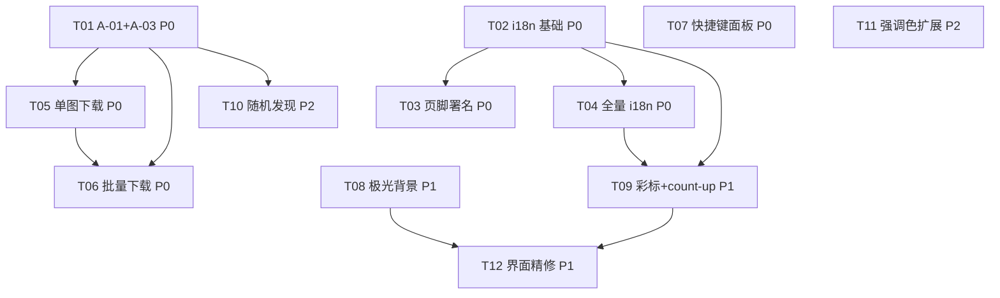

# SkyChart Pro · 二期增量架构设计 + 任务分解（A/B/C/D/E/F 模块）

> 架构师：高见远（Gao）｜ 基于二期增量 PRD（已逐文件核对代码现状）｜ 纯前端 vanilla JS 增量开发
> 配套：一期 `docs/system_design.md`、本期 `docs/prd_phase2_incremental.md`、本期图 `docs/class-diagram-phase2.mermaid`、`docs/sequence-diagram-phase2.mermaid`

> ⚠️ 任务数说明：角色模板默认「≤5 任务」，但本次 team-lead 在任务中明确「建议 10–16 项」，且一期设计稿即用 9 项被采纳。故本设计按**显式任务指令**拆为 **12 项**（T01–T12），每个任务均 ≥3 个相关文件，与文件分组一致。

---

## 1. 实现方案 + 框架选型（Part A·1 / 交付①）

**核心结论：保持现有技术栈，不做重写、不引入构建工具、不引入任何框架或图表库。**

| 维度 | 决策 | 理由 |
|------|------|------|
| 语言/运行 | 原生 HTML + CSS + 经典 `<script>` 全局作用域（按序加载，共享词法作用域，非 ES module） | 现状既定，PRD 明确"保持现有技术栈与模式" |
| 构建工具 | 无（Vite/Webpack 一律不引入） | 零构建，新增文件只需在 `index.html` 末尾 `<script>` 链追加 |
| UI 框架 | 无（不引入 React/Vue） | 纯 DOM 字符串拼接 + 事件委托模式已成熟 |
| 图表库 | 无（不引入 ECharts/D3/Chart.js） | 仪表盘条形/环形均手写 SVG（一期已落地），二期不新增 |
| 状态管理 | 延续 `state.js` 单一数据源 | 新增 `lang` 仅在 `state.js` 声明 |
| 持久化 | 延续 localStorage try/catch 封装风格 | 新增 `skychart_lang` 复用此风格 |
| 样式主题 | 延续 `data-theme`（明暗）正交叠加 `data-accent`（强调色） | CSS 变量驱动，随强调色联动（`--color-primary-500` 等） |
| 可视化 | 纯 SVG/CSS，零依赖 | D-01 极光用纯 CSS `@keyframes` + `prefers-reduced-motion` 降级；D-02 彩标用 CSS + Font Awesome |

**技术难点与对策**

1. **A-01 远程地址解析（核心前置）**：运行时在 `buildChartUrl` 内做"前缀映射 + 分段编码"——对绝对 `http(s)://` URL **仅编码 origin 之后路径段**（修复 `https:` 被 `encodeURIComponent` 成 `https%3A` 的 bug）；对本地 `航图/...` 路径替换为 `https://chart.wuhanqing.cn/Terminal/...` 后分段 `encodeURIComponent`。`file://` 协议下保持本地相对路径（可回退离线调试）。`charts-data.js` 不变（避免重写 1.3MB 文件）。
2. **A-03 远程失败判定**：iframe PDF 无可靠 `onerror`，复用现有 `modalLoadTimer` 8s 安全超时 + `pdfViewer` 的 `error` 事件双路兜底，超时/出错均把 `.modal-loading` 改写为友好提示 + "在源站打开 / 下载全部包"链接，**零额外请求**。
3. **B i18n 覆盖**：`I18N` 字典 + `t(key)` + 静态 `data-i18n` 由 `applyLang()` 回填 + 动态 JS 文本经 `t()` 渲染；`applyLang()` 切换时重渲 `renderDashboard/renderMySection/抽屉/卡片` 并回填 `[data-i18n]`。全量覆盖一期文本。
4. **C-01/C-02 跨域下载**：默认 `<a download href=远程URL>`，跨域时浏览器忽略 `download` 属性并退化为新标签打开（不依赖源站 CORS）；批量用 `setTimeout` 依次触发 + 轻提示"允许浏览器多下载"，不引打包库，并以页脚 r2 整包作为"下载全部"入口。
5. **D-01 性能**：纯 CSS 极光 + `prefers-reduced-motion: reduce` 时禁用动画（静态降级），不引 canvas 粒子（省电）。
6. **F-01 light-beam 联动**：首条 `.light-beam` 写死粉色 `rgba(244,63,94,…)` 改为 `var(--color-primary-500)`，随强调色联动。

---

## 2. 文件列表及相对路径（Part A·2 / 交付②）

> 约定：`[新增]` = 新建；`[修改]` = 在现有文件追加/修改。脚本在 `index.html` 末尾、`<script src="js/main.js">` 之前按依赖追加。

### 新增文件
| 文件 | 职责 | 对应 PRD |
|------|------|----------|
| `js/i18n.js` `[新增]` | `I18N` 字典、`t(key)`、`applyLang()`、`initLang()`、语言切换按钮初始化、`LANG_KEY` | B-01/B-02 |
| `js/footer.js` `[新增]` | `renderFooter()`：维护者层（GitHub/邮箱）+ 数据来源署名层（主源/JeppView/EAIP/r2 整包/原作者联系） | A-02/E-01/E-02 |
| `js/downloads.js` `[新增]` | `downloadChart()`、`downloadAllForAirport()`、`openSourceSite()`、`showBatchHint()` | C-01/C-02 |
| `js/shortcuts.js` `[新增]` | `openShortcutHelp()`、`closeShortcutHelp()`、`renderShortcutHelp()`，快捷键帮助面板（复用 `.modal`） | D-05 |
| `js/discover.js` `[新增]` | `randomChart()`：从 `DATA` 全量抽样随机打开一张航图 | D-06 |
| `js/background.js` `[新增]` | `setupBackground()`：注入/升级极光层 + `prefers-reduced-motion` 降级（写 `data-reduced-motion`） | D-01 |

### 修改文件
| 文件 | 修改点 | 对应 PRD |
|------|--------|----------|
| `js/state.js` `[修改]` | 新增 `lang`('zh'\|'en')、`LANG_KEY='skychart_lang'`、`reducedMotion` 标志 | B-01 |
| `js/dom.js` `[修改]` | 登记 `langToggle`、`footerEl`、`shortcutHelpModal`、`shortcutHelpClose`、`randomBtn`、`auroraLayer` 等 | B-02/D-05/D-06/D-01 |
| `js/utils.js` `[修改]` | 重写 `buildChartUrl`（绝对 URL 仅编码 origin 后 / 本地前缀映射远程 + 分段编码 / file:// 回退）；新增 `REMOTE_BASE`、`LOCAL_PREFIX`、`CHART_TYPE_META`（类型→色+FA 图标） | A-01/D-02 |
| `js/charts.js` `[修改]` | `renderPDFFiles` 卡片加类型彩标 + 下载按钮；`openPDFViewer` 容错（D-04 骨架 + A-03 兜底触发）；`showPDFLoading` 强化为骨架屏 | C-01/D-02/D-04/A-03 |
| `js/dashboard.js` `[修改]` | `renderDashboard` 数字 count-up + 卡片入场渐显；类型图例改用 `CHART_TYPE_META` + `t()`；文本 `t()` 化 | D-02/D-03/B |
| `js/drawer.js` `[修改]` | 加"批量下载本机场全部"按钮；抽屉文本 `t()` 化 | C-02/B |
| `js/theme-preset.js` `[修改]` | `ACCENTS` 扩至 6（新增 sunset/aurora/sakura）；`setAccent` 支持新预设 | D-07 |
| `js/modal.js` `[修改]` | `error` 事件与超时统一调用 `showPDFFallback(url)`：友好提示 + "在源站打开 / 下载全部包"链接 | A-03 |
| `js/events.js` `[修改]` | 委托：语言切换、单图下载、`批量下载`、随机发现、快捷键面板关闭、页脚交互 | B-02/C/D-05/D-06 |
| `js/keyboard.js` `[修改]` | 扩展 `setupKeyboardShortcuts`：J/K 导航、D 概览、T 主题、`?` 帮助 | D-05 |
| `js/main.js` `[修改]` | `init()` 插入顺序：`initLang → renderFooter → setupBackground → … → renderDashboard/applyLang …` | 全局 |
| `js/controls.js` `[修改]` | 国家选项"全部国家"等 `t()` 化 | B |
| `js/recent.js` `[修改]` | 「我的」区标签 `t()` 化（收藏机场/收藏航图/最近浏览/清空） | B |
| `index.html` `[修改]` | header 加 🌐 语言按钮；重写 footer 挂载点；加快捷键帮助面板 `.modal`；header/dashboard 加 🎲 发现按钮；保留/升级 3 个背景层 | B-02/A-02/E/D-05/D-06/D-01 |
| `style.css` `[修改]` | 极光背景(D-01)、类型彩标(D-02)、骨架屏(D-04)、微交互(F-04)、统一状态(F-03)、glassmorphism(F-01)、移动端(F-02)、分层页脚(E-02)、`.light-beam` 首条改 `var(--color-primary-500)`(F-01)、新强调色块(D-07) | D/F/E |

> 注：`js/favorites.js`、`js/airport-list.js` 本期**原则上不改动**（F 精修若需扩展液态玻璃选择器可微调 `setupLiquidGlassEffect`，默认不改）。

---

## 3. 数据结构与接口（Part A·3 / 交付③）

> 完整类图见 `docs/class-diagram-phase2.mermaid`（以模块为类，标注属性/方法/依赖）。

### 3.1 新增状态（`js/state.js`）
```js
// 语言：'zh' | 'en'，localStorage 持久化
let lang = 'zh';
const LANG_KEY = 'skychart_lang';

// 是否降级动画（由 setupBackground 写，prefers-reduced-motion 时 true）
let reducedMotion = false;
```

### 3.2 localStorage 键名约定（新增）
| 键 | 值 | 模块 |
|----|----|------|
| `skychart_lang` | `'zh'\|'en'` | `i18n.js` |
| （既有）`skychart_favorites` / `skychart_fav_charts` / `skychart_recent_airports` / `skychart_recent_charts` / `skychart_accent` | 见一期设计 | 既有 |

### 3.3 I18N 字典结构（`js/i18n.js`）
```js
// 两层字典：zh / en；key 统一小驼峰点分
const I18N = {
  zh: {
    'nav.overview': '概览',
    'lang.toggle': '中 / EN',
    'footer.maintainer': '维护者',
    'footer.source': '数据来源',
    'footer.sourceMain': '主数据源 chart.wuhanqing.cn（Daniel_清寒 · WuHanqing2005）',
    'footer.sourceJepp': '部分航图由 Jeppesen JeppView 提供',
    'footer.edition': 'EAIP 版本',
    'footer.downloadAll': '下载全部航图',
    'footer.visitSource': '访问源站',
    'footer.originalContact': '原作者联系：wuhanqing2005@gmail.com · 微信 Daniel_Qinghan',
    'pdf.failTitle': '航图加载失败',
    'pdf.failDesc': '远程航图暂时无法打开，可在源站查看或下载全部航图包。',
    'pdf.openSource': '在源站打开',
    'pdf.downloadAll': '下载全部航图包',
    'download.single': '下载',
    'download.batch': '批量下载本机场全部',
    'download.batchHint': '已依次发起下载，请允许浏览器进行多次下载。',
    'type.approach': '进近图', 'type.departure': '离场图', 'type.arrival': '进场图',
    'type.taxiway': '滑行图', 'type.airport': '机场图', 'type.other': '其它',
    'shortcut.title': '键盘快捷键',
    'shortcut.updown': '↑/↓ 或 J/K  导航机场',
    'shortcut.search': '/  搜索',
    'shortcut.dash': 'D  概览仪表盘',
    'shortcut.theme': 'T  切换主题',
    'shortcut.help': '?  本帮助',
    'shortcut.esc': 'Esc  关闭',
    'discover': '发现',
    // … 其余一期文案（空态/加载态/我的区/控制栏等）全量覆盖
  },
  en: { /* 对应英文 */ }
};

function t(key) {                       // 取词，缺省回退 zh 再回退 key
  const dict = I18N[lang] || I18N.zh;
  return (dict && dict[key] != null) ? dict[key] : (I18N.zh[key] != null ? I18N.zh[key] : key);
}

function applyLang() {                  // 回填 [data-i18n] + 重渲动态区
  document.documentElement.setAttribute('lang', lang);
  document.querySelectorAll('[data-i18n]').forEach(el => {
    const k = el.getAttribute('data-i18n');
    if (k) el.textContent = t(k);
  });
  if (typeof renderDashboard === 'function') renderDashboard();
  if (typeof renderMySection === 'function') renderMySection();
  if (drawerAirportCode) openAirportDrawer(drawerAirportCode); // 抽屉打开时同步重填
}

function initLang() {                   // 读 localStorage → 设 lang → applyLang → 绑定按钮
  try { lang = localStorage.getItem(LANG_KEY) || 'zh'; } catch (e) { lang = 'zh'; }
  if (lang !== 'en') lang = 'zh';
  applyLang();
  if (langToggle) langToggle.addEventListener('click', () => {
    lang = lang === 'zh' ? 'en' : 'zh';
    try { localStorage.setItem(LANG_KEY, lang); } catch (e) {}
    applyLang();
  });
}
```

### 3.4 `buildChartUrl` 新实现（`js/utils.js`）
```js
const REMOTE_BASE = "https://chart.wuhanqing.cn/Terminal/";
const LOCAL_PREFIX = "航图/";

/**
 * 构建航图可访问 URL。
 * - 绝对 http(s) URL：仅编码 origin 之后的路径段（修复 https: 被编码成 https%3A 的 bug）。
 * - 本地 path：http(s) 部署下把 "航图/" 前缀替换为远程基址后再分段 encodeURIComponent；
 *   file:// 协议下保持本地相对路径（离线回退）。
 */
function buildChartUrl(path) {
  if (!path) return "";
  if (/^https?:\/\//i.test(path)) {
    const m = path.match(/^(https?:\/\/[^/]+)(\/.*)?$/i);
    if (!m) return path;
    const origin = m[1];
    const rest = m[2] || "";
    if (!rest) return origin;
    return origin + rest.split("/").map((s) => encodeURIComponent(s)).join("/");
  }
  const isFile = location.protocol === "file:";
  let p = path;
  if (!isFile && p.indexOf(LOCAL_PREFIX) === 0) {
    p = REMOTE_BASE + p.slice(LOCAL_PREFIX.length);
  }
  return p.split("/").map((s) => encodeURIComponent(s)).join("/");
}
```

### 3.5 类型彩色标签元数据（`js/utils.js`，供卡片/图例复用）
```js
const CHART_TYPE_META = {
  approach: { color: 'var(--color-success)',        icon: 'fa-plane-arrival' },   // 绿
  departure:{ color: 'var(--color-accent-blue)',    icon: 'fa-plane-departure' }, // 蓝
  arrival:  { color: 'var(--color-accent-purple)',  icon: 'fa-plane-arrival' },   // 紫
  taxiway:  { color: 'var(--color-accent-orange)',  icon: 'fa-route' },           // 橙
  airport:  { color: 'var(--color-neutral-400)',    icon: 'fa-map-location-dot' },// 灰
  other:    { color: 'var(--color-neutral-500)',    icon: 'fa-file-pdf' }
};
```

### 3.6 下载模块（`js/downloads.js`）
```js
function downloadChart(airportCode, filename) {     // C-01 单图下载
  const chart = (DATA.charts[airportCode] || []).find(f => f.filename === filename);
  if (!chart) return;
  const url = buildChartUrl(chart.path);
  const a = document.createElement('a');
  a.href = url;
  a.download = chart.filename;        // 跨域时浏览器忽略 download，退化为新标签打开
  a.target = '_blank';
  a.rel = 'noopener';
  document.body.appendChild(a); a.click(); a.remove();
}

function downloadAllForAirport(airportCode) {       // C-02 批量下载（依次触发 + 提示）
  const charts = DATA.charts[airportCode] || [];
  if (!charts.length) return;
  charts.forEach((f, i) => setTimeout(() => downloadChart(airportCode, f.filename), i * 400));
  showBatchHint(t('download.batchHint'));
}

function openSourceSite(airportCode) {              // A-03 兜底：在源站打开（按 folder 定位）
  const chart = (DATA.charts[airportCode] || [])[0];
  const url = chart ? buildChartUrl(chart.path) : 'https://chart.wuhanqing.cn/';
  const m = url.match(/^(https?:\/\/[^/]+)(\/.*)?$/i);
  const folder = m && m[2] ? m[2].split('/').slice(0, 2).join('/') : '';
  window.open('https://chart.wuhanqing.cn/Terminal/' + folder, '_blank', 'noopener');
}
```

### 3.7 页脚渲染（`js/footer.js`）
```js
const R2_ZIP = 'http://r2.wuhanqing.cn/chart-wuhanqing-cn/202607_Terminal.zip';
const SOURCE_SITE = 'https://chart.wuhanqing.cn/';
const MAINTAINER_GITHUB = 'https://github.com/Wolfzzzzz';
const MAINTAINER_EMAIL = 'zhang429500@icloud.com';

function renderFooter() {                            // 维护者(上/醒目) + 数据来源(下/次要)
  if (!footerEl) return;
  const ed = (DATA.meta && DATA.meta.edition) || 'EAIP2026-07.V1.3_Web';
  footerEl.innerHTML = `… 维护者层(GitHub+邮箱) … 分隔 … 数据来源层(主源/JeppView/版本/r2/源站/原作者联系) …`;
}
```

### 3.8 快捷键帮助 + 随机（新增模块）
```js
// js/shortcuts.js
function openShortcutHelp();   // 填 #shortcutHelpModal 内容(.modal.active) 并锁滚动
function closeShortcutHelp();  // 移除 .active + 恢复滚动

// js/discover.js
function randomChart();        // 全量抽样 → openPDFViewer(code, filename)

// js/background.js
function setupBackground();    // 写 data-reduced-motion; 升级背景层为极光
```

### 3.9 强调色扩展（`js/theme-preset.js`）
```js
const ACCENTS = ["pink", "ocean", "forest", "sunset", "aurora", "sakura"]; // D-07 +3
// setAccent 逻辑不变，仅需在 style.css 补 [data-accent="sunset"|"aurora"|"sakura"] 变量块
```

### 3.10 PDF 容错（`js/modal.js` + `js/charts.js`）
```js
// modal.js：error 事件 与 8s modalLoadTimer 超时 统一调用
function showPDFFallback(url, airportCode) {        // A-03 兜底 UI
  modalLoading.style.display = 'flex';
  modalLoading.innerHTML = `
    <div class="empty-state">
      <div class="empty-icon"><i class="fas fa-exclamation-triangle"></i></div>
      <h3 class="empty-text">${t('pdf.failTitle')}</h3>
      <p>${t('pdf.failDesc')}</p>
      <div class="pdf-fallback-actions">
        <a class="download-btn" href="${SOURCE_SITE}" target="_blank" rel="noopener">${t('pdf.openSource')}</a>
        <a class="download-btn" href="${R2_ZIP}" target="_blank" rel="noopener">${t('pdf.downloadAll')}</a>
      </div>
    </div>`;
}
// charts.js openPDFViewer：保持 modalLoading 显示 spinner + 8s 超时；onerror/超时 → showPDFFallback
```

---

## 4. 程序调用流程（Part A·4 / 交付④）

> 完整时序图见 `docs/sequence-diagram-phase2.mermaid`。覆盖 4 条关键路径：(a) 启动初始化（含 i18n/footer/background）(b) 点击语言切换 (c) 点击航图下载/批量下载 (d) 远程 PDF 加载失败兜底。

**关键交互约定**
- `buildChartUrl` 为所有远程访问前置：A-03/C-01/C-02/D-06 均依赖其修复（T01 最早）。
- 语言切换走 `applyLang()` 单一入口：回填 `data-i18n` + 重渲动态区，无需刷新。
- 下载始终经 `buildChartUrl(chart.path)` 取远程 URL，跨域退化为新标签。
- PDF 容错复用 8s `modalLoadTimer` 超时 + `error` 事件双路，统一落到 `showPDFFallback`。

---

## 5. 待明确事项（Part A·5 / 交付⑧）

经核对代码，**8 个待确认问题全部采用 PRD 推荐方案**（已在设计中落地）：

| # | 问题 | 裁定（采用推荐） |
|---|------|------------------|
| 1 | A-01 落地方式 | **运行时 `buildChartUrl` 解析**（不改 1.3MB 数据文件），修复绝对 URL 编码 bug；`file://` 回退本地 |
| 2 | C-01/C-02 跨域下载 | 默认 `<a download>` + 新标签兜底；不依赖源站 CORS |
| 3 | C-02 批量下载 | 依次触发 + 提示允许多下载；页脚 r2 整包为"下载全部"入口 |
| 4 | A-03 失败判定 | 复用 8s `modalLoadTimer` 超时兜底（零额外请求） |
| 5 | B i18n 覆盖 | 全量覆盖一期文本 |
| 6 | D-01 性能 | 纯 CSS 极光 + `prefers-reduced-motion` 降级 |
| 7 | E-01 邮箱口径 | 维护者统一 `zhang429500@icloud.com`；来源署名保留原作者邮箱 |
| 8 | 免责声明更正 | 现有"均来源于Jeppesen"句重写为客观描述（主源 chart.wuhanqing.cn + 部分 JeppView） |

**非阻塞小决策（已采用，备查）**
- `light-beam` 首条粉色改 `var(--color-primary-500)`（F-01）。
- 类型图例/标签统一走 `t('type.*')`，`CHART_TYPE_META` 仅管色+图标（D-02/B 协同）。
- 快捷键 `?` 面板复用 `.modal` 模式，关闭与现有 Esc 链路合并（D-05）。
- 随机发现按钮置于 header（与🌐并列），同时仪表盘可放入口（D-06）。
- count-up 在 `prefers-reduced-motion` 下跳过动画直接置终值（D-03）。

---

## 6. 依赖包列表（Part B·6 / 交付⑥）

- **无新增 npm 依赖**（项目本就零构建、零依赖、无 `package.json` 运行时依赖）。
- 复用现有 **Font Awesome 6.4.0 CDN**（已通过 `<link>` 引入），二期仅用其既有图标：`fa-plane-arrival` / `fa-plane-departure` / `fa-route` / `fa-map-location-dot` / `fa-globe` / `fa-download` / `fa-question` / `fa-dice` 等（均含于 6.4.0）。
- 新增 6 个 `js/*.js` 为纯原生脚本，按 `<script src>` 顺序加载，无打包、无转译、无类型检查。

---

## 7. 任务列表（Part B·7 / 交付⑤）

> 实现顺序即 ID 顺序；每个任务 ≥3 个相关文件；`依赖` 列指向前置任务；`PRD` 标注对应编号。

### T01 · P0 · A-01 + A-03 远程 URL 解析修复 + PDF 容错骨架
- **源文件**：`js/utils.js`、`js/charts.js`、`js/modal.js`
- **依赖**：无
- **内容**：`utils.js` 重写 `buildChartUrl`（绝对 URL 仅编码 origin 后 / 本地前缀映射远程 + 分段编码 / file:// 回退）；`charts.js` 的 `openPDFViewer` 保持 spinner + 8s `modalLoadTimer` 超时；`modal.js` 的 `error` 事件与超时统一调用 `showPDFFallback(url, code)` 显示友好提示 + "在源站打开 / 下载全部包"链接（含 D-04 骨架屏样式占位）。
- **对应 PRD**：A-01、A-03、D-04

### T02 · P0 · B-01/B-02 i18n 基础设施
- **源文件**：`js/i18n.js` `[新增]`、`js/state.js`、`js/dom.js`、`index.html`、`style.css`、`js/events.js`
- **依赖**：无
- **内容**：`i18n.js` 建 `I18N` 字典(zh/en)、`t(key)`、`applyLang()`、`initLang()`、`LANG_KEY`；`state.js` 加 `lang`；`dom.js` 登记 `langToggle`；`index.html` header 加 🌐 `#langToggle` 按钮（含 `data-i18n`）；`style.css` 加语言按钮样式；`events.js` 绑定语言切换（或 `initLang` 内绑）。
- **对应 PRD**：B-01、B-02

### T03 · P0 · A-02 / E-01 / E-02 页脚署名 + 维护者
- **源文件**：`js/footer.js` `[新增]`、`index.html`、`style.css`
- **依赖**：T02（页脚文案经 `t()`）
- **内容**：`footer.js` 实现 `renderFooter()`（维护者层：GitHub Wolfzzzzz + `zhang429500@icloud.com` 上/醒目；数据来源层：主源 chart.wuhanqing.cn、JeppView、EAIP 版本、r2 整包链接、原作者联系 下/次要）；重写 `index.html` 页脚为挂载点 + `data-i18n`；`style.css` 分层页脚样式（含深色适配）；更正旧"均来源于Jeppesen"免责声明为客观描述。
- **对应 PRD**：A-02、E-01、E-02

### T04 · P0 · B 全量文案 i18n 化（动态区回填）
- **源文件**：`js/i18n.js`、`js/dashboard.js`、`js/drawer.js`、`js/charts.js`、`js/recent.js`、`js/controls.js`
- **依赖**：T02
- **内容**：把仪表盘标签/抽屉字段/空态加载态/「我的」区/控制栏选项等全部改为 `t(key)`；`CHART_TYPE_LABEL` 改为 `t('type.*')`；补全 `I18N.en` 全量英文；确保 `applyLang()` 重渲后文案即时切换并持久化。
- **对应 PRD**：B-01、B-02

### T05 · P0 · C-01 单图下载按钮
- **源文件**：`js/downloads.js` `[新增]`、`js/charts.js`、`js/events.js`、`style.css`
- **依赖**：T01
- **内容**：`downloads.js` 实现 `downloadChart()`；`charts.js` 的 `renderPDFFiles` 卡片加"⬇ 下载"按钮（与星标并列，带 `data-code/data-filename`）；`events.js` 在 `pdfContainer` 委托拦截 `.chart-download-btn` → `downloadChart`；`style.css` 卡片下载按钮样式。
- **对应 PRD**：C-01

### T06 · P0 · C-02 批量下载本机场全部
- **源文件**：`js/downloads.js`、`js/drawer.js`、`js/charts.js`、`js/events.js`、`style.css`
- **依赖**：T05、T01
- **内容**：`downloads.js` 实现 `downloadAllForAirport()` + `showBatchHint()`；机场航图列表区 `section-header` 右侧与抽屉内各加"批量下载本机场全部"按钮；`events.js` 委托拦截；`style.css` 按钮样式；失败/拦截给出提示。
- **对应 PRD**：C-02

### T07 · P0 · D-05 快捷键帮助面板 + 扩展快捷键
- **源文件**：`js/shortcuts.js` `[新增]`、`js/keyboard.js`、`index.html`、`style.css`
- **依赖**：无
- **内容**：`shortcuts.js` 实现 `openShortcutHelp()/closeShortcutHelp()/renderShortcutHelp()`（`.modal` 模式列出 ↑/↓·J/K、/、D、T、?、Esc）；`keyboard.js` 扩展 `setupKeyboardShortcuts` 增加 J/K 导航、D 概览(`switchView`)、T 主题(`themeToggle.click`)、`?` 调 `openShortcutHelp()`；`index.html` 加 `#shortcutHelpModal`；`style.css` 帮助面板样式。
- **对应 PRD**：D-05

### T08 · P1 · D-01 动态极光背景 + reduced-motion
- **源文件**：`js/background.js` `[新增]`、`index.html`、`style.css`
- **依赖**：无
- **内容**：`background.js` 实现 `setupBackground()`（检测 `prefers-reduced-motion` 写 `data-reduced-motion`）；`index.html` 保留 3 个背景层（可重命名为 `.aurora`）；`style.css` 用 `@keyframes` 漂移极光渐变层，颜色走 `var(--color-primary-500)`，随明暗/强调色联动，`@media (prefers-reduced-motion: reduce)` 禁用动画。
- **对应 PRD**：D-01

### T09 · P1 · D-02 / D-03 类型彩标 + count-up + 入场渐显
- **源文件**：`js/charts.js`、`js/dashboard.js`、`style.css`
- **依赖**：T04（类型标签 i18n）、T02
- **内容**：`utils.js` 定义 `CHART_TYPE_META`（色+FA 图标，已在 T01 一并落地）；`charts.js` 卡片加类型彩标（色块 + `fa` 图标 + `t('type.*')`）；`dashboard.js` 统计数字 `countUp()` 滚动 + 卡片入场 `fade-in`（reduced-motion 跳过）；`style.css` 彩标/入场动画样式。
- **对应 PRD**：D-02、D-03

### T10 · P2 · D-06 随机航图 / 发现
- **源文件**：`js/discover.js` `[新增]`、`js/events.js`、`index.html`、`style.css`
- **依赖**：T01
- **内容**：`discover.js` 实现 `randomChart()`（全量抽样 → `openPDFViewer`）；`index.html` header 加 🎲 `#randomBtn`；`events.js` 委托点击；`style.css` 按钮样式。
- **对应 PRD**：D-06

### T11 · P2 · D-07 更多强调色预设
- **源文件**：`js/theme-preset.js`、`index.html`、`style.css`
- **依赖**：无
- **内容**：`theme-preset.js` 的 `ACCENTS` 扩至 6（新增 sunset/aurora/sakura），`setAccent` 不变；`index.html` 色板加 3 个 `.accent-swatch`；`style.css` 补 `[data-accent="sunset"|"aurora"|"sakura"]` 变量覆盖块（--color-primary-500/400/600 + --shadow-glow）。
- **对应 PRD**：D-07

### T12 · P1 · F-01~F-04 界面精修
- **源文件**：`style.css`、`index.html`、`js/events.js`、`js/main.js`
- **依赖**：T09（light-beam 联动）、T08（背景）
- **内容**：`style.css` 细化 glassmorphism（高光/阴影分层/圆角节奏）；`.light-beam` 首条写死粉色改 `var(--color-primary-500)`；移动端适配（抽屉侧栏/触控 ≥44px/语言·批量入口可达）；空/加载/错误态统一（含中英双语文案骨架）；微交互（hover 抬升/点击涟漪/星标动画）；`events.js` 扩展 `setupLiquidGlassEffect` 选择器覆盖新按钮/卡片；`main.js` 确保 `setupBackground` 等初始化顺序。
- **对应 PRD**：F-01、F-02、F-03、F-04

---

## 8. 共享知识（Part B·8 / 交付⑦）

- **DOM 引用集中**：所有 `getElementById`/`querySelector` 只在 `js/dom.js` 登记，其它模块直接引用常量；散落的 `document.querySelector` 一律禁止。
- **事件统一委托**：所有新增交互在 `js/events.js` 的 `setupEventListeners()` 内用事件委托绑定（下载/批量/语言/随机/页脚），不在各渲染模块内绑定监听器（`?` 面板关闭等也走委托）。
- **状态集中**：新增可变状态只在 `js/state.js` 声明（`lang`/`reducedMotion`）；列表类变化一律改 `filterState` 后调 `applyFilters()`。
- **localStorage 封装风格**：所有持久化（`skychart_lang` 等）读写全 `try/catch`，读取失败回退默认，写入失败静默忽略，不碰 DOM。
- **SVG/CSS 走 CSS 变量**：极光/彩标/强调色均用 `var(--color-primary-500)` 等，随 `[data-theme]` 与 `[data-accent]` 联动，不写死颜色（F-01 的 light-beam 首条即改为该变量）。
- **新脚本加载顺序**：`index.html` 末尾、`<script src="js/main.js">` 之前追加 `i18n.js → footer.js → downloads.js → shortcuts.js → discover.js → background.js`（顺序不敏感，均经 `init()` 调用）。
- **初始化顺序（`main.js` init）**：`loadFavorites → loadRecentAirports/Charts → loadFavoriteCharts → initAccent → initLang → renderFooter → setupBackground → renderAirportList → setupEventListeners → initControls → setupKeyboardShortcuts → renderMySection → renderDashboard → switchView('browse') → showPDFEmptyState → setupThemeToggle → setupMobileSidebar → setupModalLoading → setupFooterInteractions → setupLiquidGlassEffect → setupShortcutHelp`（如独立绑定）。
- **复合键约定**：单图/最近航图仍用 `code + "::" + filename`。
- **远程地址单一出口**：所有远程访问（预览/下载/兜底）必须经 `buildChartUrl(chart.path)`，不得直接拼 URL。

---

## 9. 任务依赖图（Part B·9 / 交付⑦续）



> 根任务（无前置）：T01、T02、T07、T08、T11。
> 关键链：T01（远程解析）是 C-01/C-02/D-06 与 A-03 兜底的公共前置，必须最先落地。
